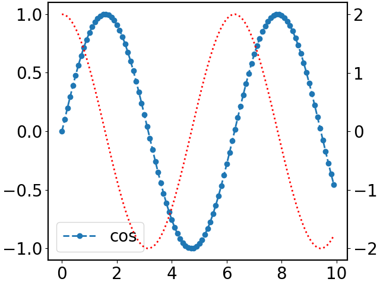

# C++ binding for Python matplotlib


## How to use 

1. basic example
   
```c++
#include "matplotlib.hpp"

int main()
{
    auto plt = matplotlibcpp::PLT();
    plt.plot({1, 3, 2}, "--o", {{"label", "cos"}});
    plt.xticks({0, 2});
    plt.legend();

    plt.savefig("basic.png");
    plt.show();
}
```


2. subplots example
   
```c++
#include <cmath>
#include "matplotlib.hpp"

int main()
{
    auto plt = matplotlibcpp::PLT();
    int n    = 100;
    std::vector<double> x(n), y(n), z(n);
    for (int i = 0; i < n; ++i) {
        x[i] = i * 10.0 / n;
        y[i] = std::sin(x[i]);
        z[i] = std::cos(x[i]);
    }

    auto ax = plt.subplots(2, 1, {7, 7}, {{"sharex", "all"}}).second;

    ax[0].plot(x, y, "-", {{"color", "red"}, {"linewidth", "6"}, {"label", "sin"}});
    ax[0].set_title("sin(x)");
    ax[0].legend();

    ax[1].plot(x, z, "b--");
    ax[1].set_title("cos(x)");

    plt.savefig("subplots.png");
    plt.show();
}
```


3. twinx example

```c++
#include "matplotlib.hpp"

int main()
{
    auto plt = matplotlibcpp::PLT();
    int n    = 100;
    std::vector<double> x(n), y(n), z(n);
    for (int i = 0; i < n; ++i) {
        x[i] = i * 10.0 / n;
        y[i] = std::sin(x[i]);
        z[i] = 2 * std::cos(x[i]);
    }

    auto ax = plt.subplots().second;

    ax.plot(x, y, "--o", {{"label", "cos"}});
    ax.legend();

    auto tax = ax.twinx();
    tax.plot(x, z, ":r");

    plt.savefig("twinx.png");
    plt.show();
}
```




## How to compile

```bash
cd matplotlibcpp
mkdir build
cd build
cmake ..
make
```


## Reference

1. https://docs.python.org/3/c-api/index.html
2. https://pythonextensionpatterns.readthedocs.io/en/latest/cpp_and_cpython.html
3. https://matplotlib.org/stable/index.html
4. https://github.com/lava/matplotlib-cpp
